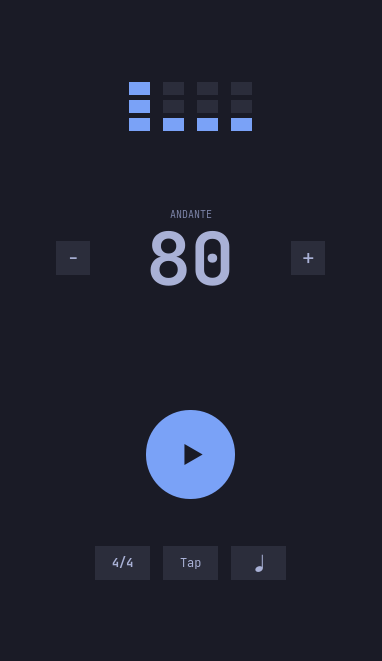
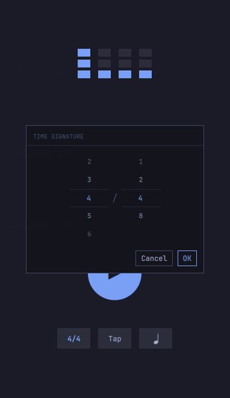
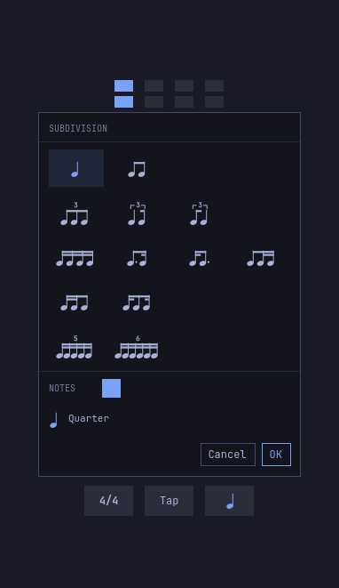
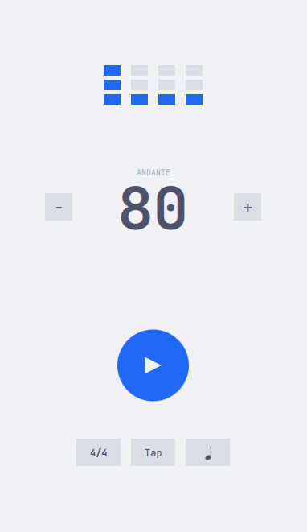
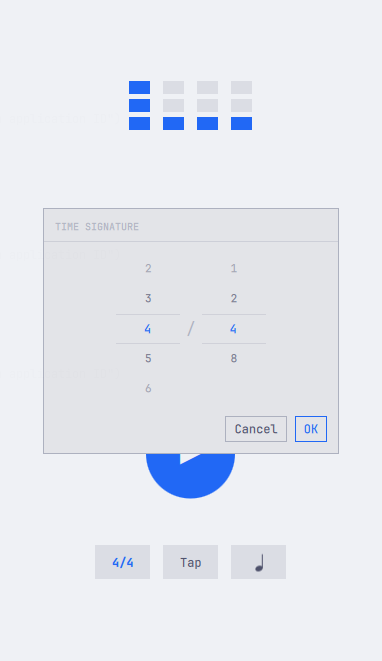
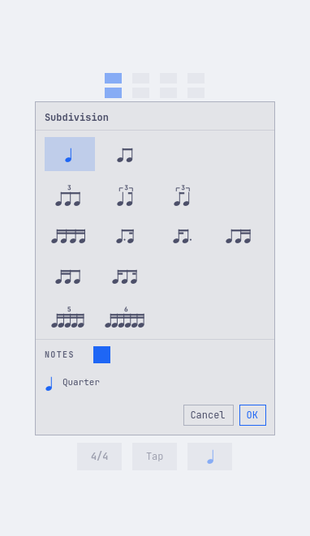

# Winkel

 

A metronome for [Omarchy](https://omarchy.org). The audio runs in a small Rust
backend and the interface in Quickshell, and the look follows your Omarchy
theme live: switch themes with `omarchy theme set` and Winkel repaints without
a restart, the way [Flea](https://github.com/thisisgm/flea) does.

<p align="center">
  
  
  
</p>
<p align="center">
  
  
  
</p>
<p align="center"><sub>The main view, the time signature editor and the subdivision editor, in Tokyo Night and Catppuccin Latte.</sub></p>

## Why Winkel

The mechanical metronome was invented by Dietrich Nikolaus Winkel, in
Amsterdam, in 1814: a spring-driven inverted pendulum with one fixed and one
sliding weight. Johann Nepomuk Maelzel took Winkel's ideas, added a numbered
scale, named the device a metronome and patented it in England in 1815. From
1816 he mass-produced it as "Maelzel's Metronome", which is why scores still
mark tempos with M.M. This app carries the name of the man who actually built
it.

## Features

- **Sample-accurate clicks.** Each click is mixed in at an exact frame of the
  audio output, through [cpal](https://github.com/RustAudio/cpal) on PipeWire
  or ALSA. The beat meters follow the same timeline, so what you see matches
  what you hear, give or take audio and display latency.
- **No lost ticks on Bluetooth.** Earbuds switch their amplifier off during
  silence, and a metronome is mostly silence, so the next tick gets swallowed.
  Winkel plays an inaudible noise floor underneath to keep the link awake.
- **Tempo at hand.** Set 10 to 400 BPM with the − and + buttons, the arrow
  keys, tap tempo, or by typing the number. Above it, the classical marking
  names the tempo: Largo, Andante, Allegretto, Presto and so on.
- **Time signatures.** Click the signature to pick 1 to 16 beats over a 1, 2,
  4 or 8: 4/4, 6/8, 3/2, 12/8 and the rest. The tick follows the bottom
  number, so 6/8 at 120 BPM ticks on the eighth note.
- **Accents per beat.** Each beat has three bars. Fill one, two or three for a
  low, medium or high tick, or leave them empty for a silent beat.
- **Subdivisions in notation.** The button right of Tap shows the beat's
  rhythm as a musical figure. Its editor offers eighths, triplets, swing,
  dotted rhythms, sixteenth groups, quintuplets and sextuplets, and the note
  squares turn any note into a rest, so every rhythm of up to six notes per
  beat is within reach.
- **Omarchy theming.** Colours, type sizes and spacing follow the live theme
  and update the moment it changes. Corner rounding follows Hyprland.
- **Ready for translation.** Every word comes from a catalogue, plurals follow
  each language's rules, and right-to-left languages mirror the window. See
  [docs/i18n.md](docs/i18n.md).
- **Remembers your settings.** Tempo, time signature, accents and subdivision
  are saved in `~/.config/winkel/state.json`. The first launch opens at 80 BPM
  in 4/4. Settings saved under the app's earlier names, in
  `~/.config/metronome` or `~/.config/pulse`, are carried over once.
- **One at a time.** Launching Winkel again leaves the running one alone, so
  two metronomes never tick against each other.
- **Keyboard first.** Every control works from the keyboard. Press `?` in the
  app for the full list.

| Key | Action |
| --- | --- |
| `space` | start or stop |
| `t` | tap tempo |
| `↑` / `↓` | tempo ±1, with `shift` ±5; `PgUp` / `PgDn` ±10 |
| `1`, `2`, `4`, `8` | set the time signature's bottom number |
| `tab` | move to the next control |
| `enter` | press the focused control |
| `esc` | stop, or close a dialog |
| `?` | show all keys |
| `ctrl+q` | quit |

## Requirements

Winkel runs on Linux in a graphical session.

| Component | Needed | Notes |
| --- | --- | --- |
| **Quickshell** | yes | Runs the interface (`qs`). On Arch, the `quickshell` package. |
| **ALSA library** | yes | Connects the audio backend to PipeWire, PulseAudio or ALSA. On Arch, `alsa-lib`. |
| **Wayland or X11** | yes | Any desktop works; Omarchy's Hyprland is home. |
| **JetBrainsMono Nerd Font** | recommended | The default font. Set `WINKEL_FONT` to use another. |
| **Omarchy** | optional | Provides the live theme. Without it, Winkel uses its built-in colours. |
| **Hyprland** | optional | Provides corner rounding and the reduced-motion setting. |

To build from source you also need Rust 1.89 or newer, the ALSA development
headers (part of `alsa-lib` on Arch, `libasound2-dev` on Debian and Ubuntu),
`pkg-config` and `make`.

## Installing

### Arch Linux and Omarchy (AUR)

```sh
yay -S winkel
```

There are three packages: `winkel` builds the latest release from source,
`winkel-bin` installs the prebuilt binary, and `winkel-git` builds the
development version.

### Prebuilt binary

Every [release](https://github.com/DouglasdeMoura/winkel/releases) includes
binaries for x86_64 and aarch64. They need Quickshell and the ALSA library,
but no Rust toolchain. Download the archive for your machine, then:

```sh
tar xzf winkel-*-x86_64-linux.tar.gz
cd winkel-*-x86_64-linux
sudo make install
```

### From source

```sh
git clone https://github.com/DouglasdeMoura/winkel
cd winkel
make
sudo make install    # installs to /usr/local; add PREFIX=/usr to change it
```

To remove it, run `sudo make uninstall` with the same `PREFIX`.

## Running

Start Winkel from your app launcher, or run `winkel`.

### A floating window on Hyprland

Winkel opens as a tiled window. To float it at its natural size instead, add
this rule to a file in `~/.config/hypr/`, such as `bindings.lua`. Omarchy's
Hyprland configuration is written in Lua.

```lua
o.window("^dev\\.douglasmoura\\.winkel$", { float = true, center = true, size = { 377, 610 } })
```

## Development

From a checkout, `./target/release/winkel` finds its own `ui/` folder. Always
launch the binary rather than `qs` directly: the binary tells the window where
to find its backend.

These environment variables help during development; see `src/paths.rs` and
`src/gui.rs`.

| Variable | Effect |
| --- | --- |
| `WINKEL_UI` | The `ui/` folder to load. |
| `WINKEL_BIN` | The backend binary the window starts. |
| `WINKEL_SILENT` | Run the protocol without audio, for tests and headless machines. |
| `WINKEL_LANG` | Force a language, or `pseudo` / `pseudo-rtl` to test translations. |
| `WINKEL_FONT` | The font family. |

Run the tests with:

```sh
make test           # both suites below
cargo test          # timeline, protocol, JSON, settings and translation catalogues
bash tests/ui.sh    # the Quickshell interface, offscreen
```

### Architecture

Two processes make one app, in Flea's shape:

```
winkel                             the launcher
 └─ qs -p ui/shell.qml             the window; WINKEL_BIN tells it which backend to start
     └─ winkel --backend           JSON lines over stdio, see docs/protocol.md
         └─ cpal output stream     the timeline and the clicks
```

- `src/backend/engine.rs` is the metronome: one timeline counted in audio
  frames, the click synthesis, and the realtime rules. The audio callback only
  touches atomics, and new settings land on the next click, where a musician
  expects them. With no audio device, a silent clock keeps the visuals moving.
- `ui/Main.qml` is the one screen and its dialogs.
- `ui/Rhythm.js` and `ui/NoteFigure.qml` hold the subdivision cells and draw
  their notation.
- `ui/Theme.qml` reads the theme's `colors.toml` and `shell.toml` from
  `~/.local/state/omarchy/current/theme/` before the first paint, and watches
  `theme.name`, the one file `omarchy-theme-set` rewrites in place, so the
  watch survives theme switches.
- `ui/I18n.qml` picks the language and loads its catalogue from `ui/i18n/`.
- `src/json.rs` is all of the wire-format code. Apart from cpal, the backend
  uses only Rust's standard library.

Releases follow [docs/releasing.md](docs/releasing.md), and changes are
recorded in [CHANGELOG.md](CHANGELOG.md).

## License

Winkel is released under the [MIT License](LICENSE). The metronome shape in its
icon and the play and stop marks on its transport come from
[Phosphor Icons](https://phosphoricons.com), also MIT; see
[`packaging/ICON-LICENSE`](packaging/ICON-LICENSE).
